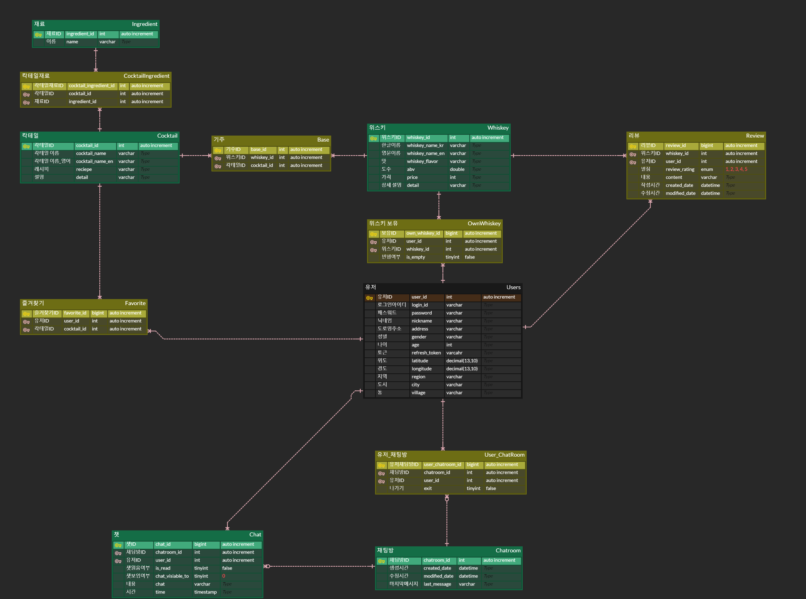
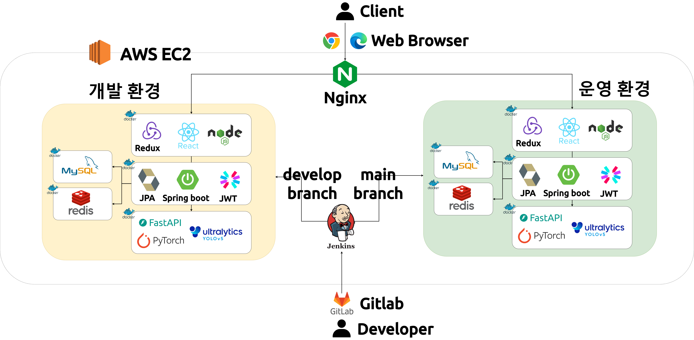

# Whiskey Wiki (위스키 위키) - 위스키 입문자를 위한 서비스

 

## 0. 목차

1. 진행 기간
2. 서비스 소개
3. 프로젝트 산출물
4. 기술 스택
5. 팀원 소개

 

## 1. 진행 기간

<b>2024. 02. 26. 월요일 ~ 2024. 04. 04. 목요일 (6주)</b>

 

## 2. 서비스 소개

### 메인 기능

- AI를 통한 위스키 인식 및 등록

- 나만의 온라인 술 저장공간, My Bar

- 다른 유저의 My Bar 탐색 및 거래

- 다양한 위스키의 상세 정보 제공

- 칵테일 레시피 추천

 

#### 1. 메인 페이지

#### 2. 회원가입

#### 3. 위스키 AI 인식 및 등록

#### 4. 마이바(My Bar) 이동 및 마이바의 위스키 상태 전환 (빈병으로)

.gif>)

#### 5. 위스키 목록 및 상세페이지

#### 6. 교환을 위한 지도 (Exchange Map) 및 다른 유저의 마이바 열람

 

## 3. 프로젝트 산출물

### 와이어 프레임 / 목업

👉 [Figma 링크](https://www.figma.com/file/5JPFZwNMkIZ8hfc880JaEb/Untitled?type=design&node-id=0-1&mode=design&t=rFBealktMFGV35cx-0)

### API 명세서

👉 [API 명세서 링크](https://galvanized-citron-903.notion.site/API-efca2cccd96d43af85d259b38291cd82?pvs=4)

### ERD

### 시스템 아키텍처

### 포팅 메뉴얼

- 소스 클론 이후 빌드 및 배포할 수 있도록 정리한 문서
- DB 덤프 파일 : data.sql / schema.sql
- 시연 시나리오 : README.md에서 소개, 폴더에는 시연 관련 파일 저장

 

## 4. 기술 스택

### Front-End

    -3178C6?style=for-the-badge&logo=v&logoColor=white>)  
-339933?style=for-the-badge&logo=node.js&logoColor=white>) -2C8EBB?style=for-the-badge&logo=npm&logoColor=white>)  

### Back-End

 -6DB33F?style=for-the-badge&logo=Springboot&logoColor=white>)   -964B00?style=for-the-badge&logo=hibernate&logoColor=white>)

### AI

-3776AB?style=for-the-badge&logo=Python&logoColor=white>)
-009639?style=for-the-badge&logo=fastapi&logoColor=white>)
-F05032?style=for-the-badge&logo=pytorch&logoColor=white>) 

### CI/CD

 
 

### Tools

   

 

## 5. 팀원 소개

|  이름  | 사진 | 담당 역할                                                                                                                                                                                                                                                                       |
| :----: |  :----: | :------------------------------------------------------------------------------------------------------------------------------------------------------------------------------------------------------------------------------------------------------------------------------ |
| 이지은 |  | - PM : 프로젝트 팀장, Git, Jira, 일정관리 및 정리, 최종발표   - Frontend : 마이바(My Bar), 지도(Exchange Map) 페이지 기능 구현 및 CSS   - Design : 와이어 프레임 제작 / 마이바(My Bar) 관련 페이지 디자인                                                                 |
| 안윤철 || - Backend : ERD 설계 / Auth(인증,인가), Users(유저 정보 관리), 채팅 관련 API 작성 - AI : Fast API, 커스텀 데이터셋 제작, 모델 학습 및 테스트                                                                                                                                 |
| 임현승 | |- Backend : ERD 설계 / JPA를 활용한 메인 API 작성   (위스키, 마이바, 지도, 칵테일, 즐겨찾기, 리뷰 관련 API 작성)                                                                                                                                                             |
| 장세영 | |- Frontend : 개인정보 조회 및 수정, 위스키 정보 및 상세 페이지 기능 구현 및 CSS   - Design : 와이어 프레임 제작 / 로고 디자인   - Archives : 팀 관련 미팅 기록 및 정리                                                                                                    |
| 조담현 | |- Backend : ERD 설계   - Infra : Docker, DockerCompose, Nginx, Jenkins, Gitlab를 활용한 CI/CD 파이프라인 구축   Gitlab에 코드 push 혹은 merge시 webhook을 trigger하여 jenkins에서 자동빌드 및 배포 구현   - Director : 프로젝트 UCC 촬영/편집                          |
| 조연주 | |- AI : 커스텀 데이터셋 제작, 모델 학습 및 테스트   - Frontend : 메인, auth(인증/인가), AI 인식, 채팅(웹소켓) 페이지 기능 구현 및 CSS   Redux, persist 설정 / axios interceptor 설정   - Design : 메인, 위스키 정보, AI 위스키 등록, 교환, 채팅, 유저관련 페이지 디자인 |
